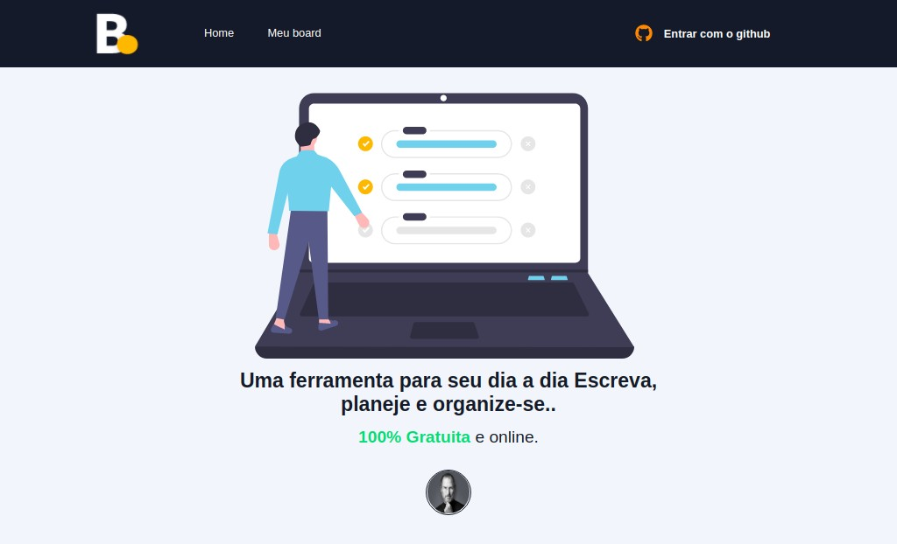
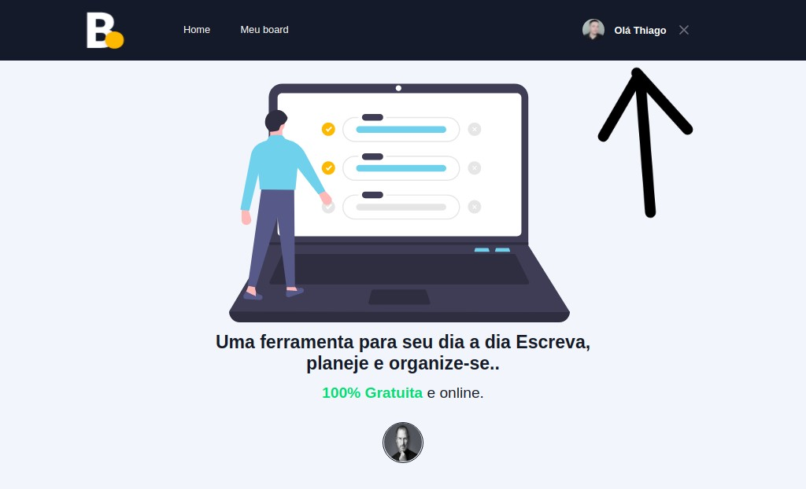
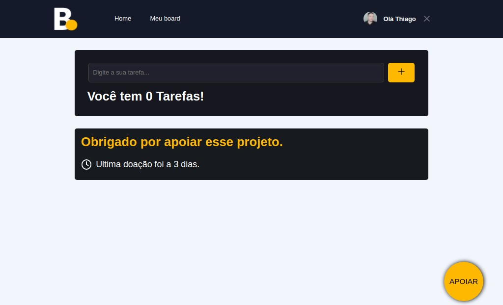
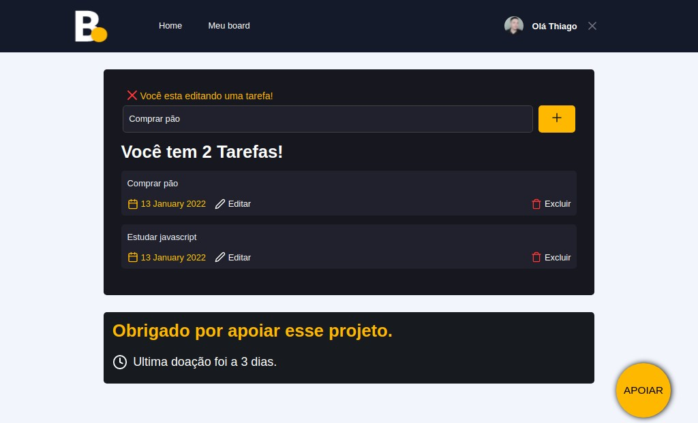
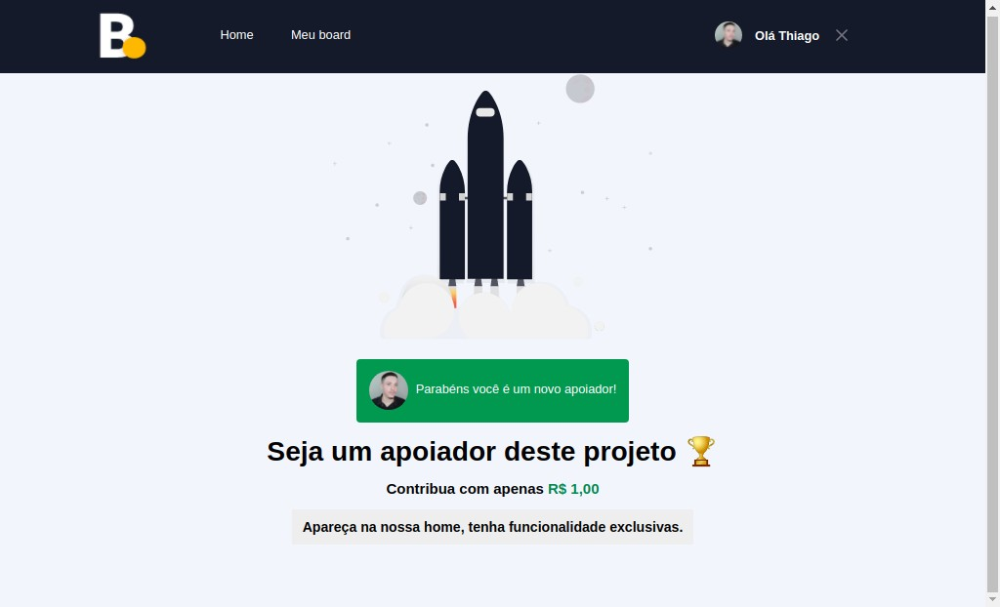

# Projeto Board

    

### Uma ferramenta para seu dia a dia Escreva, planeje e organize-se..

Nesse projeto eu usei as seguintes tecnologias:

<ul>
<li>Next.JS</li>
<li>Typescript</li>
<li>Sass</li>
<li>Next-Auth</li>
<li>Firebase</li>
<li>Date-fns</li>
<li>React-icons</li>
</ul>

<h1 style="text-align:center">
 
 
Faça o login com o Github

</h1>

<h1 style="text-align:center">
 
 
Você tem 0 tarefas

</h1>

<h1 style="text-align:center">
 
 
Crie, edite e exclua uma tarefa

</h1>

<h1 style="text-align:center">
 
 
Apoie o projeto

</h1>

<h2 style="text-align:center">Projeto não finalizado :)</h2>

Made with by Thiago
